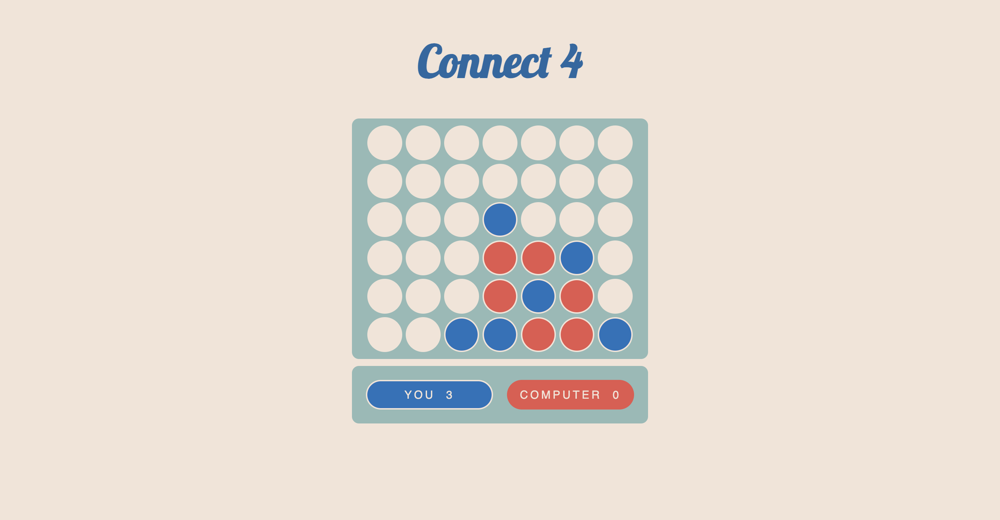

# Connect 4

Play a classic game against a computer opponent.

<!-- ROADMAP -->

## How To Play

Take turns placing disks until either you or the computer has four disks in a row (horizontally, vertically or diagonally).

Each disk has to be on the bottom row or above another disk. 

(<a href="#readme-top">back to top</a>)

## About The Project 

This game started as a project to practice jQuery, JavaScript, CSS and HTML. It quickly became a fun opportunity to develop the logic for the computer opponent!

I plan to build on the existing logic, and introduce options for easy, medium and hard modes.

(<a href="#readme-top">back to top</a>)

## Roadmap

- [ ] Deploy the game with Heroku
- [ ] Develop "hard mode" logic for computer opponent
- [ ] Add a database to store player scores

(<a href="#readme-top">back to top</a>)

<!-- CONTRIBUTING -->
## Contributing

Contributions are what make the open source community such an amazing place to learn, inspire, and create. Any contributions you make are **greatly appreciated**.

If you have a suggestion that would make this better, please fork the repo and create a pull request. You can also simply open an issue with the tag "enhancement".
Don't forget to give the project a star! Thanks again!

1. Fork the Project
2. Create your Feature Branch (`git checkout -b feature/AmazingFeature`)
3. Commit your Changes (`git commit -m 'Add some AmazingFeature'`)
4. Push to the Branch (`git push origin feature/AmazingFeature`)
5. Open a Pull Request

(<a href="#readme-top">back to top</a>)

<!-- LICENSE -->
## License

Distributed under the MIT License. See `LICENSE.txt` for more information.

(<a href="#readme-top">back to top</a>)

<!-- CONTACT -->
## Contact

Cait Martin Newnham | hello@iamcait.com

(<a href="#readme-top">back to top</a>)
